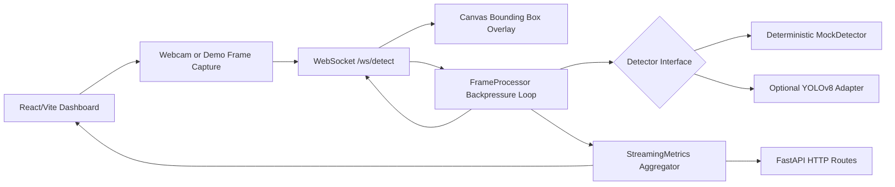

# Real-Time Object Detection Dashboard

Webcam/video object detection dashboard with a FastAPI WebSocket backend, YOLO-ready detector abstraction, deterministic mock inference, canvas bounding boxes, and live detection analytics.

This project is designed as a portfolio bridge between robotics/computer vision systems and deployed web applications. It runs reliably in mock mode without model weights, then can be switched to YOLOv8 when `ultralytics`, `opencv-python`, and local weights are available.

## Architecture



## Repo Layout

```text
.
├── backend/
│   ├── app/
│   │   ├── api/              # HTTP and WebSocket route builders
│   │   ├── detectors/        # Detector protocol, mock detector, optional YOLO adapter
│   │   ├── services/         # Frame processing and metrics aggregation
│   │   ├── config.py
│   │   ├── main.py
│   │   └── models.py
│   ├── tests/                # Dependency-light unit tests
│   ├── Dockerfile
│   ├── pyproject.toml
│   └── requirements.txt
├── frontend/
│   ├── src/
│   │   ├── components/
│   │   ├── lib/
│   │   ├── App.tsx
│   │   └── styles.css
│   ├── Dockerfile
│   ├── package.json
│   └── vite.config.ts
├── config/dashboard.example.json
├── docker-compose.yml
└── .env.example
```

## Backend Setup

Prerequisites:
- Python 3.11+
- Node.js 20.19+ or 22.12+ for the Vite 7 frontend toolchain

```bash
cd backend
python3 -m venv .venv
source .venv/bin/activate
pip install -r requirements.txt
uvicorn app.main:app --reload --host 0.0.0.0 --port 8000
```

The backend defaults to deterministic mock mode:

```bash
DETECTOR_MODE=mock uvicorn app.main:app --reload
```

To use YOLOv8 with local weights:

```bash
pip install ".[yolo]"
DETECTOR_MODE=yolo YOLO_WEIGHTS=./weights/yolov8n.pt uvicorn app.main:app --reload
```

`DETECTOR_MODE=auto` only attempts YOLO when the configured weights path exists, then falls back to mock mode if initialization fails.

## Frontend Setup

```bash
cd frontend
npm install
npm run dev
```

Open `http://localhost:5173` and connect to `ws://localhost:8000/ws/detect`.

## Docker

```bash
cp .env.example .env
docker compose up --build
```

The compose setup mounts `./weights` read-only for optional YOLO weights. Mock mode does not need that directory.

## Tests

The included unit tests cover pure backend logic and do not require FastAPI, OpenCV, ultralytics, or network access:

```bash
cd backend
python3 -m unittest discover -s tests
```

## Streaming Notes

The browser sends one frame and waits for a detection response before sending another eligible frame. That acknowledgement loop is the main backpressure mechanism: it keeps the server from accumulating stale frames when inference slows down. For real robotics deployments, this freshness-first pattern is usually preferable to processing every captured frame after it is already old.

The mock detector exists for portfolio and demo reliability. It produces deterministic YOLO-shaped detections, so reviewers can see the WebSocket stream, bounding boxes, analytics, and event panel even without GPU drivers, camera permission, OpenCV wheels, or model weights.
